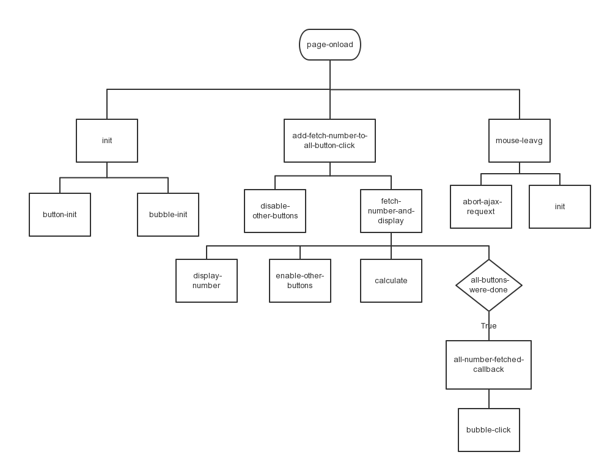

#Top实践报告

#前置技能
    花了大概有半天多的时间来学习LiveScript的基本语法, 主要的内容在列表推倒,
    函数和OOP部分. 在后期编程实践中也主要涉及这些语法. 半天的时间感觉过长,
    一开始看的时候太纠结于细节, 想要完整的看完教程. 通过这次实践, 个人认为
    学习已有部分基础的新东西不能太纠结于细节, 这样不但会拖慢学习速度, 而且
    因为要记忆的东西太多, 会影响学习效果, 事倍功半. 快速学习的方法应该是浏览,
    掌握主体, 略过细节然后编程实践, 实践过程中对需要的内容再进行查阅
    这样才能真正的掌握住那些细节知识

##工具配置
    本次实践的主要工具为Grunt, 安装的时候并没有遇到问题, 主要的困难在于Gruntfile
    的配置. 初次使用Grunt的体会是上手学习的难度较大, 学习曲线陡峭. 但是不可否认,
    自动化工具的确是能大大减轻debug过程中的那些重复枯燥的工作, 在livereload,
    livescript, watch三个主要插件的配合下, 预编译和刷新全自动完成, 
    自己只需要集中精力处理代码逻辑

##编程实践
    这一部分是最重要的工作, 我在动手写之前, 先模仿老师的代码打了一份草稿, 主要的目
    的在于体会老师的思路和熟悉LiveScript的语法, 并且这样实践之后, 效果很好. 
    整体的思路为响应用户对页面做出的操作, 采用自顶向下的工作方式. 下面以S1为例简述我的思考过程:
        
    页面加载完成初始化:
        init
            button-init
            bubble-init
                
        移入鼠标点击button
            add-fetch-number-to-all-button-click
                set-class
                disable-other-buttons
                fetch-number-and-display
                    display-number
                    enable-other-buttons
                    calculate
                    if all-buttons-were-done
                    then all-number-fetched-callback
                        bubble-click
        
        移出鼠标
            abort-ajax-requext
            init

#图示

